# 📦 Sistem Pendataan Inventaris Barang

Aplikasi web berbasis PHP dan MySQL untuk mengelola data inventaris barang, termasuk fitur peminjaman, pengembalian, dan monitoring stok secara real-time.

---

## 🖼️ Screenshot

### 👨‍💼 Admin
 
**Dashboard**
 
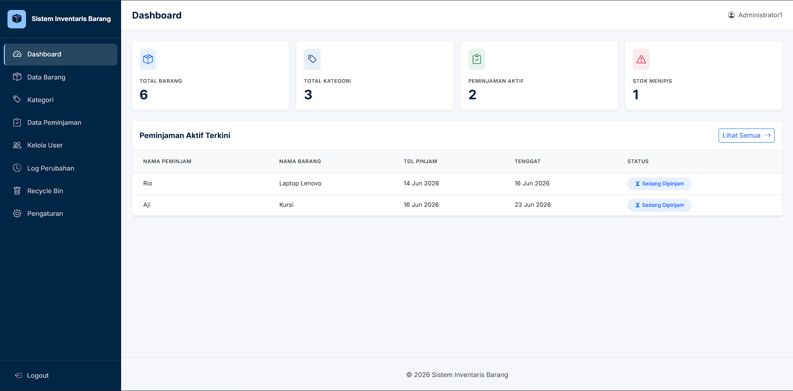
 
**Data Barang**
 
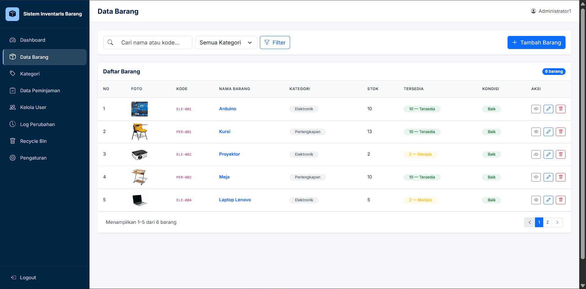
 
**Kategori**
 
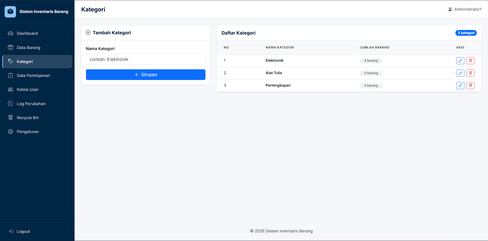
 
**Peminjaman**
 
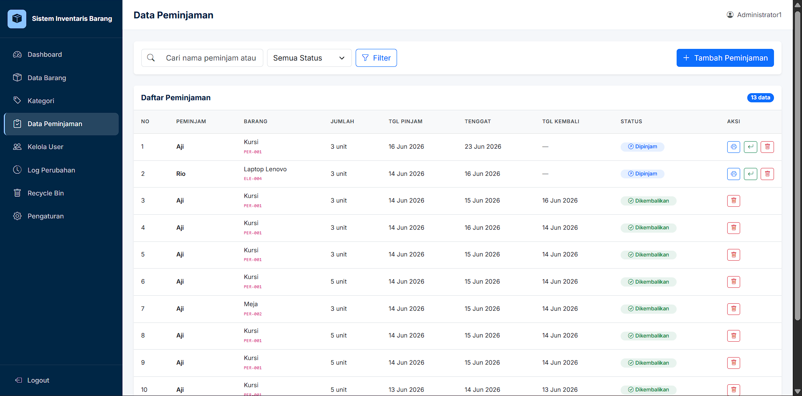
 
**Kelola User**
 
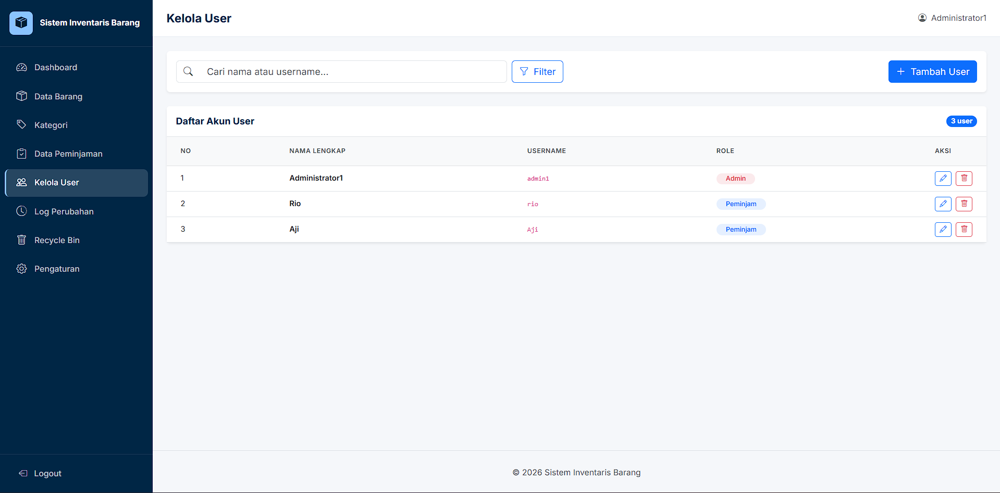
 
**Log Perubahan**
 
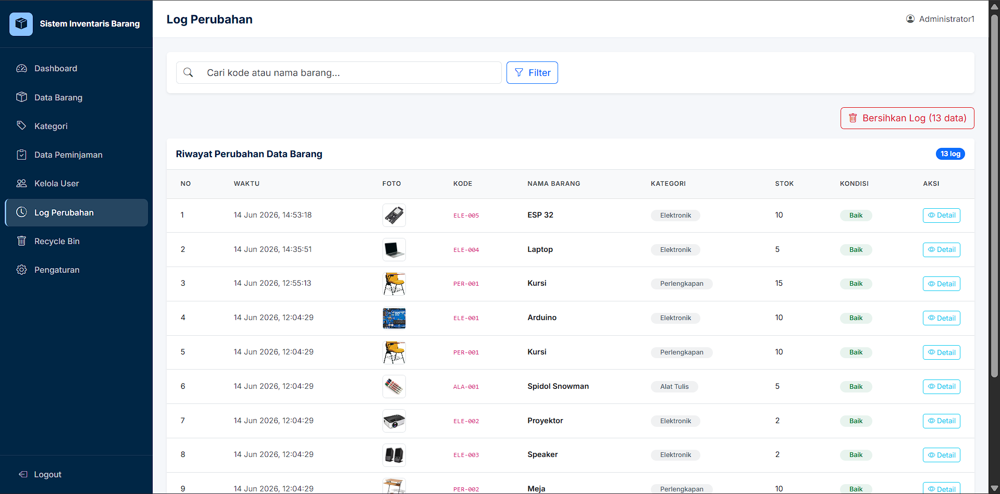

**Recycle Bin**
 
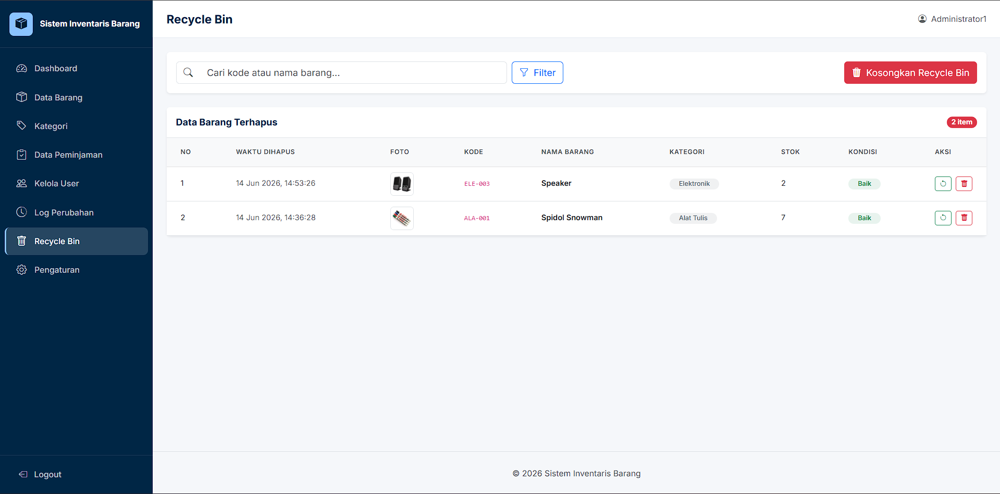

**Pengaturan**
 
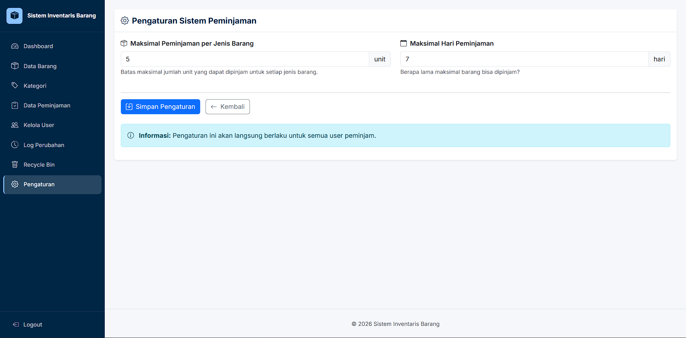

### 👤 Anggota / Peminjam
 
**Dashboard Anggota**
 
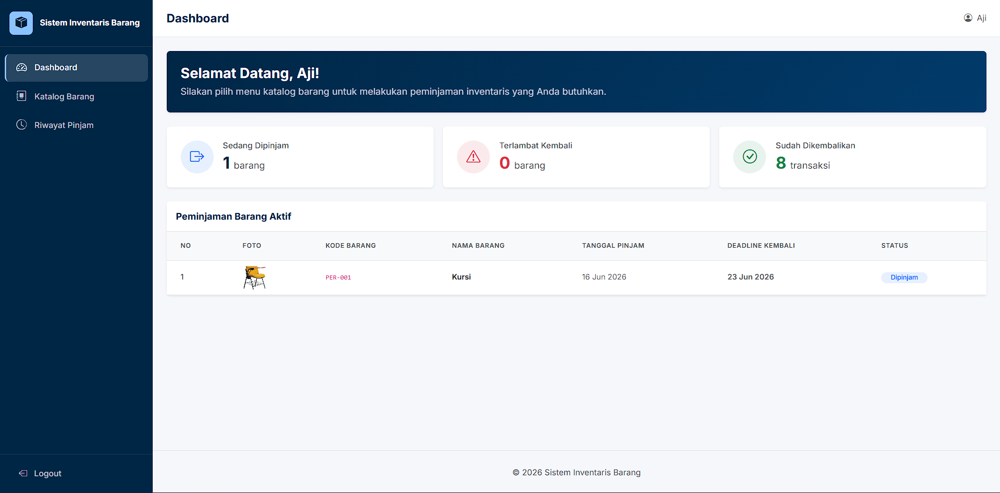
 
**Katalog**
 
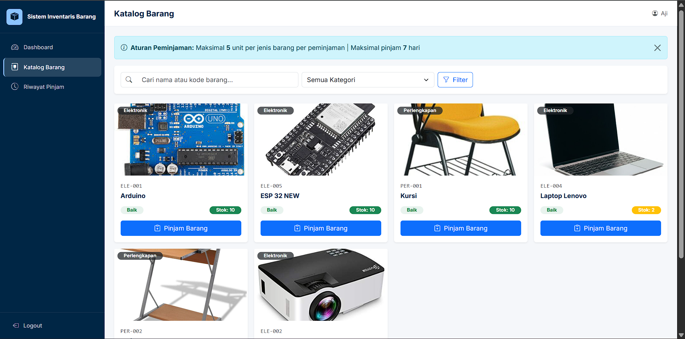
 
**Riwayat Peminjaman**
 
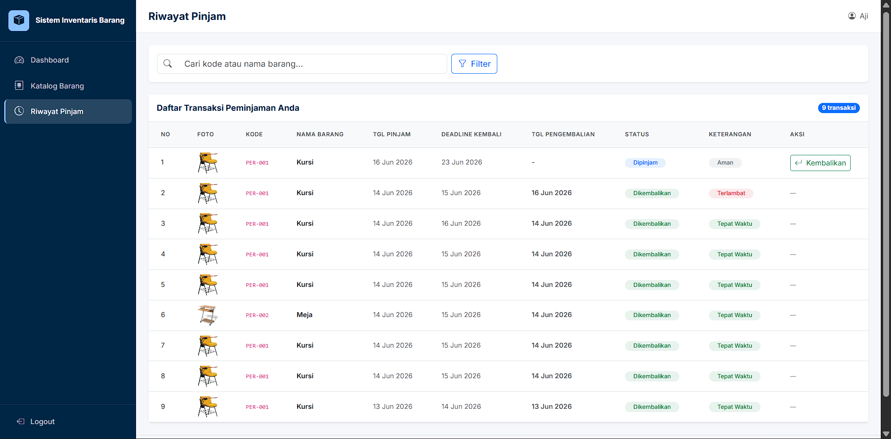
 
---

## 🛠️ Teknologi

- PHP (Native)
- MySQL
- Bootstrap 5
- Laragon (local server)
- Javascript

---

## ⚙️ Cara Menjalankan

### 1. Prasyarat
Pastikan sudah menginstall:
- [Laragon](https://laragon.org/download/) (Full / Standard)
- Browser (Chrome, Firefox, dll)

### 2. Clone Repository
Buka terminal / Git Bash, lalu jalankan:
```bash
git clone [Copas link repository github ini]
```

### 3. Pindahkan ke Folder Laragon
Salin atau pindahkan folder hasil clone ke:
```
C:/laragon/www/inventaris-barang/
```

### 4. Jalankan Laragon
- Buka aplikasi **Laragon**
- Klik tombol **Start All** untuk menjalankan Apache dan MySQL

### 5. Buat Database
- Buka browser, akses: `http://localhost/phpmyadmin`
- Klik **New** di panel kiri
- Buat database baru dengan nama: `inventaris_db`
- Pilih database `inventaris_db`, lalu klik tab **Import**
- Klik **Choose File**, pilih file `database/inventaris_db.sql`
- Klik **Go / Import**

### 6. Konfigurasi Koneksi
- Buka file `includes/config.php`
- Sesuaikan pengaturan berikut jika perlu:
```php
$host     = 'localhost';
$user     = 'root';       // default Laragon
$password = '';           // default Laragon (kosong)
$database = 'inventaris_db';
```

### 7. Jalankan Aplikasi
- Buka browser, akses: `http://localhost/inventaris-barang`
- Login menggunakan akun demo di bawah

---

## 🔑 Akun Demo

| Role | Username | Password |
|------|----------|----------|
| Admin | `admin1` | `password` |
| Anggota / Peminjam | `aji` | `123` |

---

## 📁 Struktur Folder

```
inventaris_barang/
│
├── admin/
│   ├── barang.php
│   ├── dashboard.php
│   ├── detail_barang.php
│   ├── detail_log_perubahan.php
│   ├── edit_barang.php
│   ├── get_kode_barang.php
│   ├── kategori.php
│   ├── log_perubahan.php
│   ├── peminjaman.php
│   ├── pengaturan.php
│   ├── recycle_bin.php
│   ├── tambah_barang.php
│   └── users.php
│
├── auth/
│   ├── login.php
│   └── logout.php
│
├── includes/
│   ├── alert_modal.php
│   ├── config.php
│   ├── config.example.php
│   ├── footer.php
│   ├── header.php
│   └── sidebar.php
│
├── peminjam/
│   ├── dashboard.php
│   ├── katalog.php
│   └── riwayat.php
│
├── uploads/
│   └── barang/
│       └── (file gambar barang)
│
├── struk.php
├── .gitignore
└── README.md
```

---

## ✨ Fitur

- 🔐 Login & autentikasi admin
- 📊 Dashboard statistik (total barang, kategori, peminjaman aktif, stok menipis)
- 📦 Manajemen data barang & kategori
- 📋 Pencatatan peminjaman & pengembalian barang
- ⚠️ Deteksi otomatis peminjaman terlambat

---

## 👤 Developer

Dibuat sebagai proyek akhir mata kuliah Praktikum Pemrograman Web 1 dan Praktikum Pemrograman Basis Data.
Nama : Muhammad Rasyid
NIM : 25/566545/SV/27093